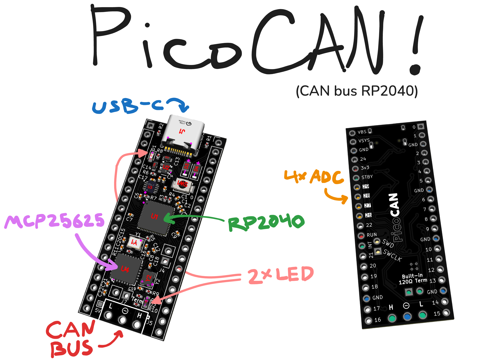
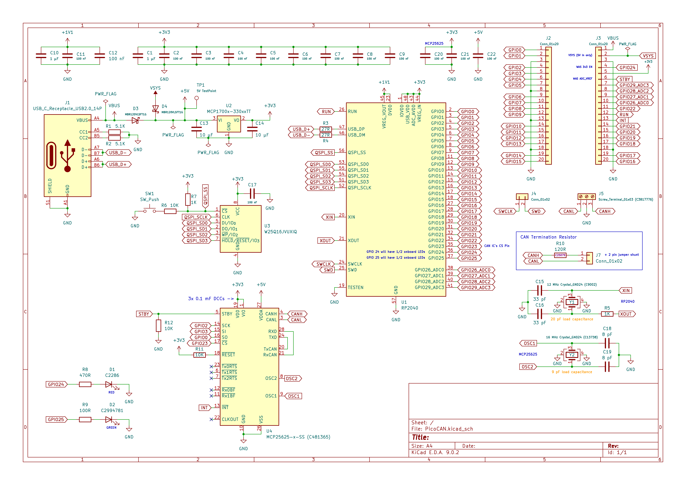

# PicoCAN
PicoCAN is a custom devboard based on the RP2040 that features a built-in CAN controller and transceiver (the `MCP25625` to be exact).

## Key Features
- USB-C connection for easy programming
- RP2040 based, with the same size as the Pi Pico
- CAN BUS using MCP25625
  - Built-in 120Ω termination resistor, which can be enabled by bridging the two pins near the `CANL` pin
- Support for powering with 5V through `VSYS` pin
- 28 usable GPIO pins, including 4 ADC pins
- Two on-board LEDs (Green and Red)
  - The red LED also shares pin `24` on the board
  - The green LED is not connected to any of the PicoCAN's pins

## Using the CAN bus

To interface with the CAN bus, you can use any library that supports the MCP25625. There are a few examples that use the [MCP_CAN](https://github.com/coryjfowler/MCP_CAN_lib) library in the `./firmware_examples` folder; they are adapted from https://github.com/coryjfowler/MCP_CAN_lib.

## Building the PicoCAN
The PicoCAN can be ordered from sites like JLCPCB (and optionally assembled too). The KiCAD source files are in `./KiCAD` and the production gerber files are in `./KiCAD/prod` along with the bom.

## Images

 

## Schematic

## BOM

| Name                                                                           | Purpose                                                                  | Quantity | Total Cost (USD) | Link                                                                                                                                                                                                                                                                                                                                                                                                                                                                                                                     | Distributor |
| ------------------------------------------------------------------------------ | ------------------------------------------------------------------------ | -------- | ---------------- | ------------------------------------------------------------------------------------------------------------------------------------------------------------------------------------------------------------------------------------------------------------------------------------------------------------------------------------------------------------------------------------------------------------------------------------------------------------------------------------------------------------------------ | ----------- |
| 10kΩ Resistors                                                                 | JLCPCB idle parts order to avoid ~8000 MOQ                               | 15       | 2.00             | https://jlcpcb.com/partdetail/26487-0402WGF1002TCE/C25744                                                                                                                                                                                                                                                                                                                                                                                                                                                                | JLCPCB      |
| JLCPCB PCB(A)                                                                  | PCBA for the devboard                                                    |          | 74.30            |                                                                                                                                                                                                                                                                                                                                                                                                                                                                                                                          | JLCPCB      |
| Breakaway 2.54mm Headers                                                       | Soldering to PCB for GPIO, Termination Resistor Jumper, SWD + SWCLK pins | 220      | 5.73             | https://www.amazon.com/Jabinco-Breakable-Header-Connector-Arduino/dp/B0817JG3XN/ref=sr_1_3?crid=2WKRDMD09IP3A&dib=eyJ2IjoiMSJ9.czj50ypkQJ1W7noQLo1BweZEBilxaPpO0ntqUIsbMOZ8NaUK7SirIiKj0zqjNVH7wel-Muxf7cilYZ1Gkm4LgajcBaFuuT2h6h5A3zPeYstX5vvQowuI_TuSg0Kxc1e53BEuy5Jd69yTYBwJ_uQCerRUqfk7djKjaq9QYkqNW6D93iLd-X65YBIYgty5NQg0PXmwjQjx0RvcIDNsFUhAgsMDf7z5tFzePYIG2SYMh9Q.pCbw9QGeBexphDohe_PNYFXcjPvPNsFaeCrxSnrcMaw&dib_tag=se&keywords=2.54mm+pin+header&qid=1775094589&sprefix=2.54mm+pin+header%2Caps%2C168&sr=8-3 | Amazon      |
| Socket Shorting Block Jumper Red Closed                                        | Enabling Termination Resistor built into PCB (MOQ 10)                    | 5        | 1.40             | https://www.jameco.com/webapp/wcs/stores/servlet/ProductDisplay?storeId=10001&langId=-1&catalogId=10001&pa=112432&productId=112432                                                                                                                                                                                                                                                                                                                                                                                       | Jameco      |
| Terminal Block Header 3 Position Top Screw 3.5mm Solder Straight Thru-Hole 10A | Connecting to CAN BUS (CANL, CANH, GND)                                  | 5        | 3.95             | https://www.jameco.com/webapp/wcs/stores/servlet/ProductDisplay?storeId=10001&langId=-1&catalogId=10001&pa=2094514&productId=2094514                                                                                                                                                                                                                                                                                                                                                                                     | Jameco      |

Exhaustive PCB component BOM available at `./KiCAD/prod/PicoCAN.csv`.
