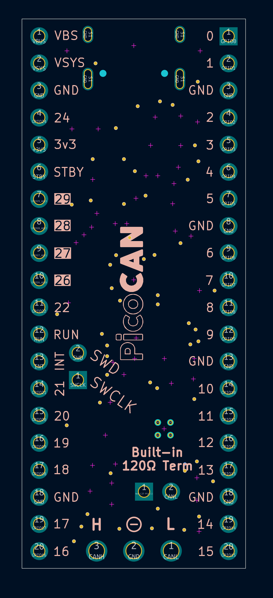
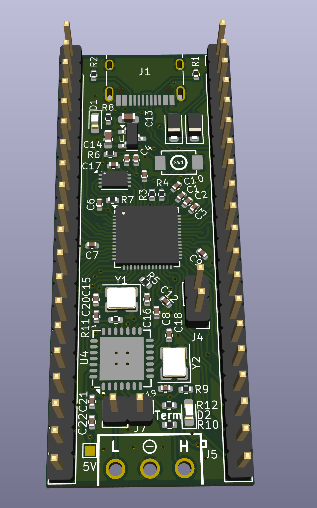

# PicoCAN
PicoCAN is a custom devboard based on the RP2040 that features a built-in CAN controller and transceiver (the `MCP25625` to be exact).

## Key Features
- USB-C connection for easy programming
- RP2040 based, with the same size as the Pi Pico
- CAN BUS using MCP25625
  - Built-in 120Ω termination resistor, which can be enabled by bridging the two pins near the `CANL` pin
- Support for powering with 5V through `VSYS` pin
- 28 usable GPIO pins, including 4 ADC pins
- Two on-board LEDs (Green and Red)
  - The red LED also shares pin `24` on the board
  - The green LED is not connected to any of the PicoCAN's pins

## Using the CAN bus

To interface with the CAN bus, you can use any library that supports the MCP25625. There are a few examples that use the [MCP_CAN](https://github.com/coryjfowler/MCP_CAN_lib) library in the `./firmware_examples` folder; they are adapted from https://github.com/coryjfowler/MCP_CAN_lib.

## Building the PicoCAN
The PicoCAN can be ordered from sites like JLCPCB (and optionally assembled too). The KiCAD source files are in `./KiCAD` and the production gerber files are in `./KiCAD/prod` along with the bom.

## Images

 
